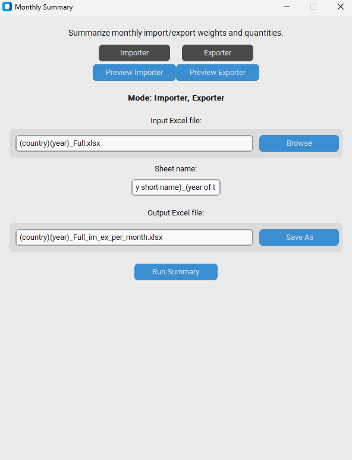

# Monthly Summary App

This app summarizes monthly import/export quantities and weights from Excel files.

---

## 🚀 Features

- ✅ CustomTkinter GUI
- 📊 Weight & Quantity summary
- 📁 Excel output formatting
- 🧩 Preview and merge rows
- 📂 Works with `.xlsx` files (EximRadars format)

---

## 📸 Screenshots

### 🖼️ Main Page  


### 🖼️ Preview Page  


---

## ⚙️ How to Run

```bash
pip install -r requirements.txt
python main.py
```

## excel setup

```Name the file as

(Country short name)(year of the data)_Full

Example:
TH2023_Full
US2024_Full

----------------------------------------------------

Name the sheet as
(Country short name)_(year of the data)

Example:
TH_2023
US_2024

----------------------------------------------------

Insert information based on this

Date of the transaction    column B
Exporter                   column E
Importer                   column I
Quantity                   column W
Weight                     column Y
```

## license

Copyright (c) 2025 Suppawat Rattanalaor


